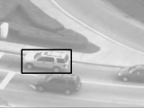

# Computer Vision Assignment 3-2 - Tracking objects in video

## Introduction

This assignment is about tracking objects in video. We will implement Lucas-Kanade tracking algorithm and test it on a video sequence.

## steps

1. Read the video sequence and extract the first frame.
2. Select a region of interest (ROI) in the first frame.
3. Track the ROI in the rest of the frames using Lucas-Kanade tracking algorithm.
4. Display the tracking results.

## results

    
    
    

